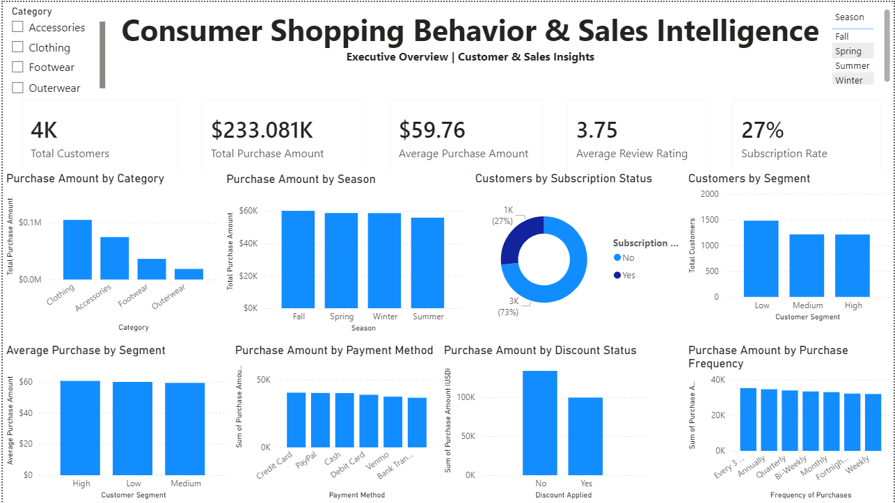
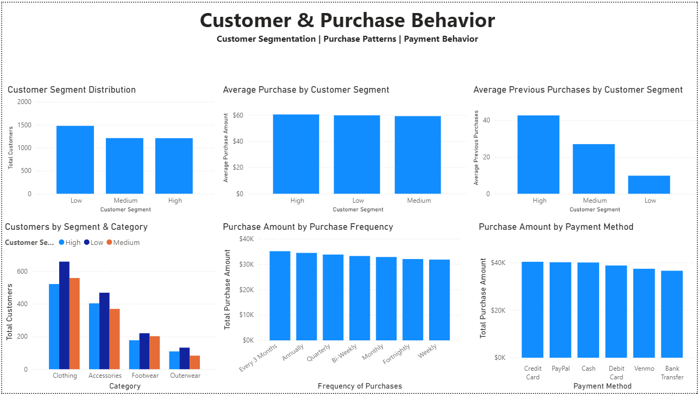

# Consumer Shopping Behavior & Sales Intelligence

## Project Overview

This project analyzes consumer shopping behavior to identify purchasing patterns, customer segments, product category trends, purchase frequency, payment preferences, discount usage, and subscription behavior.

The project uses Python for data preparation and exploratory analysis, PostgreSQL for structured SQL analysis, and Power BI for interactive business dashboards.

## Business Objective

The objective is to understand customer shopping behavior and provide data-driven insights that can support:

- Customer segmentation
- Product category analysis
- Purchase pattern analysis
- Customer engagement
- Marketing strategy
- Product planning
- Business performance monitoring

## Tools & Technologies

- Python
- Pandas
- NumPy
- Matplotlib
- PostgreSQL
- SQL
- Power BI
- DAX

## Dataset

The dataset contains 3,900 customer-level records and 18 attributes covering:

- Customer demographics
- Products and categories
- Purchase amounts
- Seasons
- Review ratings
- Subscription status
- Shipping type
- Discount and promotional usage
- Previous purchases
- Payment methods
- Purchase frequency

## Project Workflow

```text
Raw Data
   ↓
Python Data Preparation & EDA
   ↓
Cleaned Dataset
   ↓
PostgreSQL SQL Analysis
   ↓
Power BI Data Modeling & DAX
   ↓
Interactive Dashboard
   ↓
Business Insights

## Power BI Dashboard

### Executive Overview



### Customer & Purchase Behavior

